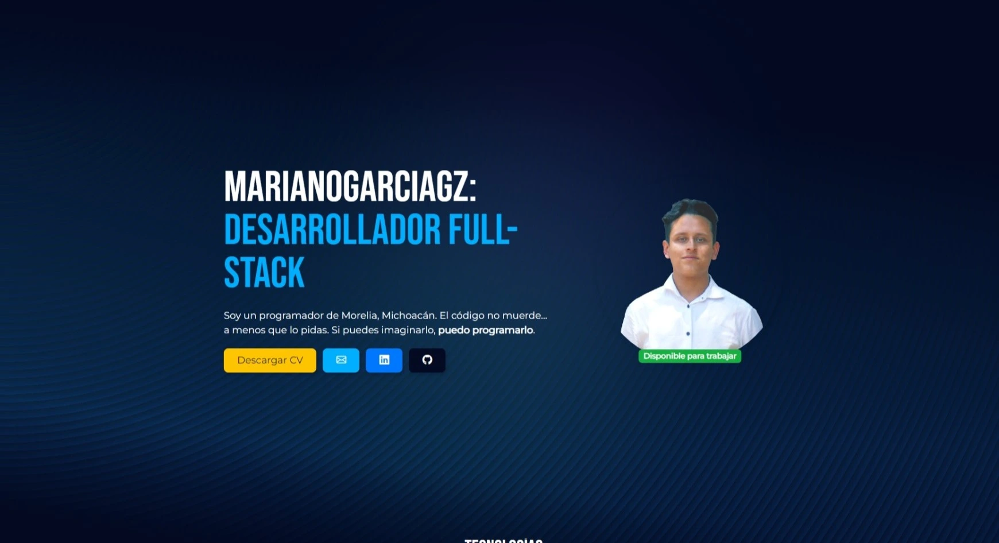

# 🚀 Welcome to Mariano's GitHub! 🚀

A multifaceted professional with expertise in **development**, **music production** and **design**, dedicated to crafting immersive digital experiences that resonate profoundly with users and clients.

    

> _Share the knowledge! 🧠_

---

## About me 🦝

I'm all about building the bridge between imagination and reality. From crafting stunning websites, developing user-friendly apps to creating captivating soundscapes for video games and commercials, and producing engaging video content, I'm here to weave magic through creativity and code.

---

## 🌟 What I Bring

Competitive spirit, boundless creativity, unwavering efficiency, and a knack for collaboration define my professional DNA. I'm not just a team player; I'm an asset to any team.
